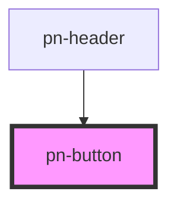

# pn-button

<!-- Auto Generated Below -->

## Properties

| Property    | Attribute    | Description | Type                                                                               | Default     |
| ----------- | ------------ | ----------- | ---------------------------------------------------------------------------------- | ----------- |
| `iconLeft`  | `icon-left`  |             | `string`                                                                           | `undefined` |
| `iconOnly`  | `icon-only`  |             | `boolean`                                                                          | `false`     |
| `iconRight` | `icon-right` |             | `string`                                                                           | `undefined` |
| `label`     | `label`      |             | `string`                                                                           | `undefined` |
| `rounded`   | `rounded`    |             | `boolean`                                                                          | `false`     |
| `shadow`    | `shadow`     |             | `boolean`                                                                          | `false`     |
| `type`      | `type`       |             | `"disabled" \| "primary" \| "secondary" \| "tertiary" \| "transparent" \| "white"` | `'primary'` |

## Dependencies

### Used by

 - [pn-header](../pn-header)

### Graph

----------------------------------------------

*Built with [StencilJS](https://stenciljs.com/)*
