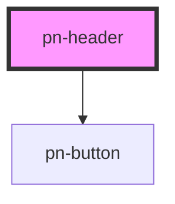

# pn-header

<!-- Auto Generated Below -->

## Properties

| Property       | Attribute       | Description | Type                                                                                                               | Default     |
| -------------- | --------------- | ----------- | ------------------------------------------------------------------------------------------------------------------ | ----------- |
| `actions`      | --              |             | `ActionButton[]`                                                                                                   | `[]`        |
| `company`      | `company`       |             | `string`                                                                                                           | `undefined` |
| `logo`         | `logo`          |             | `string`                                                                                                           | `undefined` |
| `logoAltText`  | `logo-alt-text` |             | `string`                                                                                                           | `undefined` |
| `navigation`   | --              |             | `NavigationItem[]`                                                                                                 | `[]`        |
| `showSearch`   | `show-search`   |             | `boolean`                                                                                                          | `false`     |
| `utilityLinks` | --              |             | `{ label: string; href?: string; }[]`                                                                              | `[]`        |
| `variant`      | `variant`       |             | `"centered" \| "command-palette" \| "default" \| "mega-menu" \| "sidebar" \| "split" \| "sticky" \| "transparent"` | `'default'` |

## Events

| Event          | Description | Type                  |
| -------------- | ----------- | --------------------- |
| `headerSearch` |             | `CustomEvent<string>` |

## Dependencies

### Depends on

- [pn-button](../pn-button)

### Graph

----------------------------------------------

*Built with [StencilJS](https://stenciljs.com/)*
